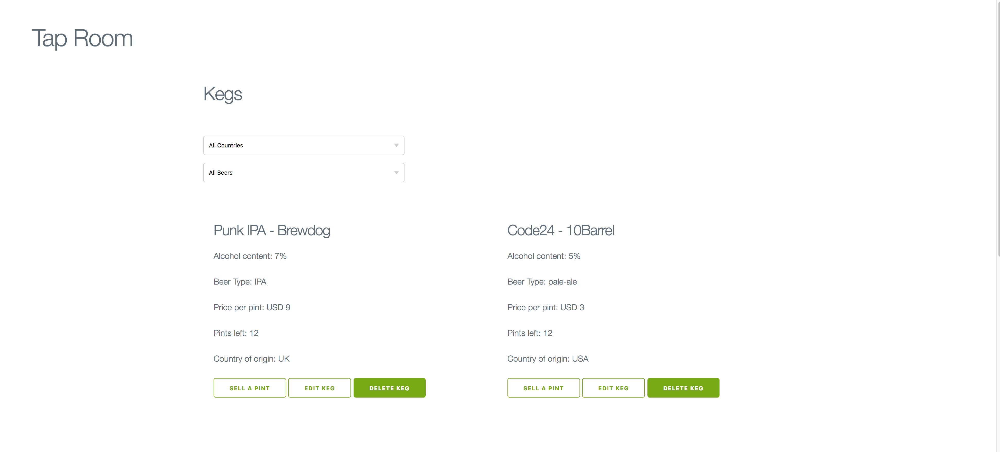
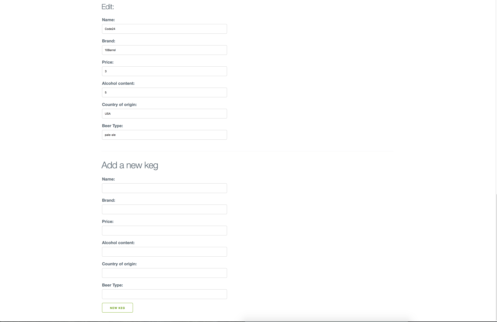

# _Tap Room_

#### _This app lets local bar owners input kegs and view, edit and delete, Thursday, June 8, 2017_

#### By _**James Higgins and Niklas Long**_

## Description

_Users can input a keg that a bar can keep on tap. This app displays the beer name, the brand, the alcohol content, the beer type, the price per pint, the pints left in the keg, and the country of origin. Users can filter by beer type, and country. Clicking "sell pint" decreases the amount of pints in the keg._

## Setup/Installation Requirements

### Access Atom Files

* _Ensure connection to the Internet_
* _On a mac using spotlight search type in terminal_
* _Once in terminal enter the following commands to clone the file to your desktop and open the repository:_
```
$ cd desktop
$ git clone https://github.com/jamesmilanhiggins/tap-room
$ cd tap-room
$ npm install
$ bower install
$ gulp serve
$ open localhost:3000 in your browser
```

## Known Bugs

* There are no known bugs at this time*


## Support and contact details

_Please contact James Higgins at James.Milan.Higgins@gmail.com if you have any questions._

## Technologies Used

* JavaScript
* Angular
* Node
* Bower
* HTML
* Milligram

### License

*This software is licensed under MIT license.*

Copyright (c) 2017 **_James Higgins and Niklas Long_**



